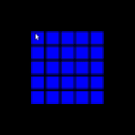

# PatternFlip Game (Base)
Base for puzzle-like games involving toggling the state of tiles on a board following patterns, implemented using the Solar2D framework.
* No menus or options
* No scoring or markers
* No ending
  
Feel free to use and adapt it for your own implementation and/or submit pull requests for fixes.

## Game in action

